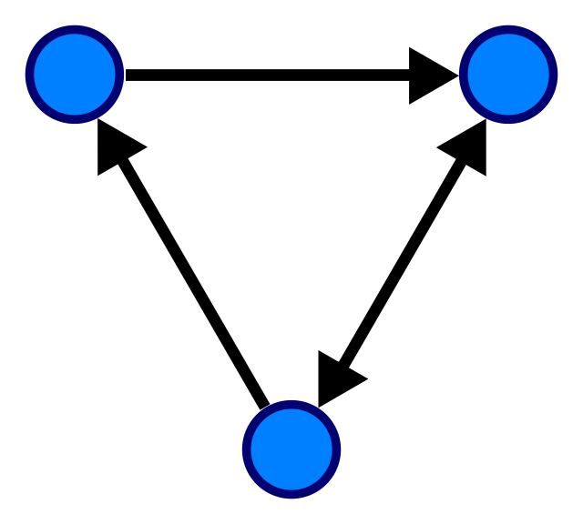

# dagger [](https://godoc.org/github.com/autom8ter/dagger)



dagger is a blazing fast, concurrency safe, mutable, in-memory directed graph implementation with zero dependencies
    
    import "github.com/autom8ter/dagger"

## Design:

- flexibility
- concurrency safe
- high performance
- simple api

## Features

- [x] native graph objects(nodes/edges)
- [x] typed graph objects(ex: user/pet)
- [x] labelled nodes & edges
- [x] depth first search
- [x] breadth first search
- [x] topological sort
- [x] concurrency safe

## Example

### Setting Nodes
```go

    var g = dagger.NewGraph()
	vm1 := g.SetNode(dagger.Path{
		XID:   "virtual_machine_1",
		XType: "infra",
	}, map[string]interface{}{})
	vm2 := g.SetNode(dagger.Path{
		XID:   "virtual_machine_2",
		XType: "infra",
	}, map[string]interface{}{})
	k8s := g.SetNode(dagger.Path{
		XID:   "kubernetes",
		XType: "infra",
	}, map[string]interface{}{})
	redis := g.SetNode(dagger.Path{
		XID:   "redis",
		XType: "infra",
	}, map[string]interface{}{
		"port": "6379",
	})
	mongo := g.SetNode(dagger.Path{
		XID:   "mongo",
		XType: "infra",
	}, map[string]interface{}{
		"port": "5568",
	})
	httpServer := g.SetNode(dagger.Path{
		XID:   "http",
		XType: "infra",
	}, map[string]interface{}{
		"port": "8080",
	})
	g.RangeNodes("*", func(n dagger.Node) bool {
		t.Logf("found node in graph: %s.%s\n", n.XType, n.XID)
		return true
	})
```


### Ranging Over Nodes

```go
    // iterate over nodes of type user
    g.RangeNodes("users", func(n dagger.Node) bool {
		t.Logf("found user node in graph: %s.%s\n", n.XType, n.XID)
		return true
	})
```

### Setting Edges

```go
    _, err := g.SetEdge(k8s.Path, vm1.Path, dagger.Node{
		Path: dagger.Path{
			XType: "depends_on",
		},
		Attributes: map[string]interface{}{},
	})
	if err != nil {
		t.Fatal(err)
	}
	_, err = g.SetEdge(k8s.Path, vm2.Path, dagger.Node{
		Path: dagger.Path{
			XType: "depends_on",
		},
		Attributes: map[string]interface{}{},
	})
	if err != nil {
		t.Fatal(err)
	}
	_, err = g.SetEdge(mongo.Path, redis.Path, dagger.Node{
		Path: dagger.Path{
			XType: "depends_on",
		},
		Attributes: map[string]interface{}{},
	})
	if err != nil {
		t.Fatal(err)
	}
	_, err = g.SetEdge(httpServer.Path, k8s.Path, dagger.Node{
		Path: dagger.Path{
			XType: "depends_on",
		},
		Attributes: map[string]interface{}{},
	})
	if err != nil {
		t.Fatal(err)
	}
```

### Iterating over Edges

```go
    g.RangeEdgesFrom("*", httpServer.Path, func(e dagger.Edge) bool {
        t.Logf("found edge in graph: %s.%s\n", e.XType, n.XID)
        return true
    })
```

### Iterating over Edges in Reverse

```go
    g.RangeEdgesTo("*", httpServer.Path, func(e dagger.Edge) bool {
        t.Logf("found edge in graph: %s.%s\n", e.XType, n.XID)
		return true
	})
```

### Depth First Search

```go
    // iterate over nodes that depend the httpServer depends on
    g.DFS("depends_on", httpServer.Path, func(node dagger.Node) bool {
		i++
		t.Logf("(%v) Reverse DFS: %s", i, node.String())
		return true
	})
```

### Breadth First Search

```go
    g.BFS("depends_on", httpServer.Path, func(node dagger.Node) bool {
		i++
		t.Logf("(%v) Reverse DFS: %s", i, node.String())
		return true
	})
```